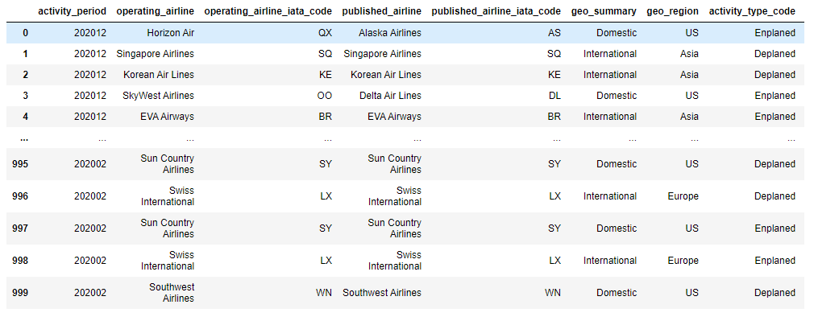
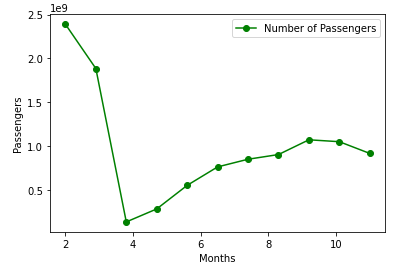
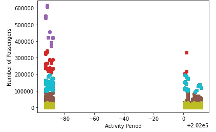
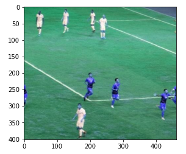
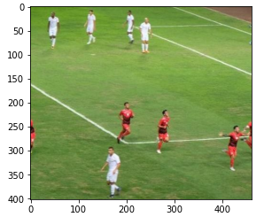

# Term Project of IoT Fundamental
Purpose: 
- Showing case which this project uses data air traffic in San Francisco International Airport Report on Monthly Passenger Traffic Statistics by Airline to see the number of pasenger.
- Showing case the implementation of K-Mean for clustering

## Group member

|  Member ID     |              Name             |        E-mail				|                         
|----------------|-------------------------------|------------------------------|
|6370394221      |Singgih Bekti Worsito			 |singbekti@gmail.com      	   	|
|6032028021      |Shakeel Ahmed        			 |shakeelchula20@gmail.com     	|
|6372084021      |Phing Lim            		 	 |limphing@gmail.com			|

## 1. Import Library
The first result was trained by 12 months ( 1st January - 31 December) 2020 infected person information.

```
import requests
import pandas as pd
from pandas.io.json import json_normalize
#from mlxtend.plotting import plot_decision_regions
from sklearn.metrics import confusion_matrix,classification_report
import matplotlib.pyplot as plt #ใช้ plot graph
import numpy as np
from sklearn import datasets, neighbors
import itertools
import random
from sklearn.cluster import KMeans
import csv
```
## 2. See Raw Data
```
response = requests.get("https://data.sfgov.org/resource/rkru-6vcg.json")
print(response.status_code)
print(response.json())
```


To make it easy to see, we are able to see the data as table
```
ps=pd.read_json('https://data.sfgov.org/resource/rkru-6vcg.json')
ps
```


## 3. Testing Plot Number of passengers by Flight from Feb-Dec 2020 

Try to get data from API and analyse total number of passenger every month then plotting the graph



## 4. K-Mean 

Now, we want to use K-Means to see the data generally. 
Prepare data set X : Operating Period and Y : Number of Passengers of all Airline in July 2019 until December 2020. 



## 5. Saving Output 

Now, we want to write CSV output file from what we have done.
Since our data is the panda dataframe, we can use to_cvs to convert output to csv.

```
compression_opts = dict(method='zip', archive_name = 'output.csv')
all_pd_data.to_csv('output.zip', index=False, compression = compression_opts)
```


Previously we show the data using K-Means for making us easy to understand the data. We can not see all the data one by one, but using clustering method, we can cluster the data then we can see it clearly. It is essential for helping us to decide what to do.
# Color Segmentation Using K-Means 
In this case, K-Means will be used for color clustering for football. This is important for us to understand how K-Means can be used for.

## Color Clustering 
### 1. Defining the libraries and import file

Let's prepare the necessary libraries and
 
```
import numpy as np
import cv2
import matplotlib.pyplot as plt

original_image = cv2.imread("C:/Users/… /football.jpg") 
plt.imshow(original_image)
```


### 2. Connverting RGB to HSV

We need to convert our image from RGB Colours Space to HSV to work ahead.
Because, according to wikipedia the R, G, and B components of an object’s color in a digital image are all correlated with the amount of light hitting the object, and therefore with each other, image descriptions in terms of those components make object discrimination difficult. Descriptions in terms of hue/lightness/chroma or hue/lightness/saturation are often more relevant.
```
img=cv2.cvtColor(original_image,cv2.COLOR_BGR2RGB)
plt.imshow(img)
```


Next, converts the MxNx3 image into a Kx3 matrix where K=MxN and each row is now a vector in the 3-D space of RGB.
```
vectorized = img.reshape((-1,3))
```
Then, We need to convert the unit8 values to float as it is a requirement of the k-means method of OpenCV.
```
vectorized = np.float32(vectorized)
```

### 3. Set Cluster

We will do cluster with k = 6
Because if you look at the image above it has 6 colors, green-colored grass and dark green, red-team, white-team, red-shadow, white-shadow.
Define criteria, number of clusters(K) and apply k-means()
```
criteria = (cv2.TERM_CRITERIA_EPS + cv2.TERM_CRITERIA_MAX_ITER, 10, 1.0)
```
OpenCV provides cv2.kmeans(samples, nclusters(K), criteria, attempts, flags) function for color clustering.
1.	samples: It should be of np.float32 data type, and each feature should be put in a single column.
2.	nclusters(K): Number of clusters required at the end
3.	criteria: It is the iteration termination criteria. When this criterion is satisfied, the algorithm iteration stops.
Actually, it should be a tuple of 3 parameters. They are ( type, max_iter, epsilon ):
Type of termination criteria. It has 3 flags as below:
cv.TERM_CRITERIA_EPS — stop the algorithm iteration if specified accuracy, epsilon, is reached.
cv.TERM_CRITERIA_MAX_ITER — stop the algorithm after the specified number of iterations, max_iter.
cv.TERM_CRITERIA_EPS + cv.TERM_CRITERIA_MAX_ITER — stop the iteration when any of the above condition is met.
4.	attempts: Flag to specify the number of times the algorithm is executed using different initial labelings. The algorithm returns the labels that yield the best compactness. This compactness is returned as output.
5.	flags: This flag is used to specify how initial centers are taken. Normally two flags are used for this:
6.	
cv.KMEANS_PP_CENTERS and cv.KMEANS_RANDOM_CENTERS.
```
K = 6
attempts=10
ret,label,center=cv2.kmeans(vectorized,K,None,criteria,attempts,cv2.KMEANS_PP_CENTERS)
```
Now convert back into uint8.
```
center = np.uint8(center)
```
Access the labels to regenerate the clustered image
```
res = center[label.flatten()]
result_image = res.reshape((img.shape))
```

### 4. Compare the results

Now, compare the pictures
```
figure_size = 15
plt.figure(figsize=(figure_size,figure_size))
plt.subplot(1,2,1),plt.imshow(img)
plt.title('Original Image'), plt.xticks([]), plt.yticks([])
plt.subplot(1,2,2),plt.imshow(result_image)
plt.title('Segmented Image when K = %i' % K), plt.xticks([]), plt.yticks([])
plt.show()
```


From that case, computer will understand about the image easily and inform us what image is that and the contain inside
