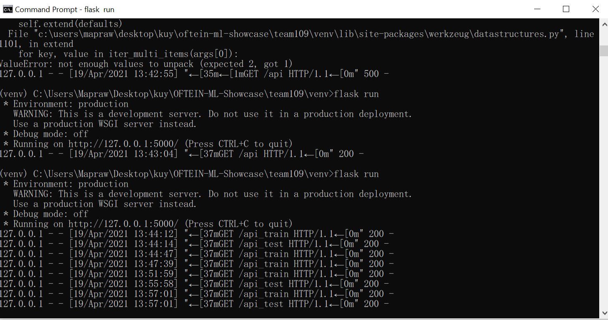
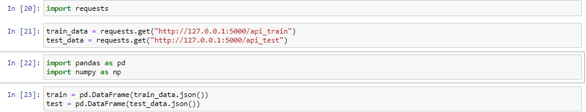
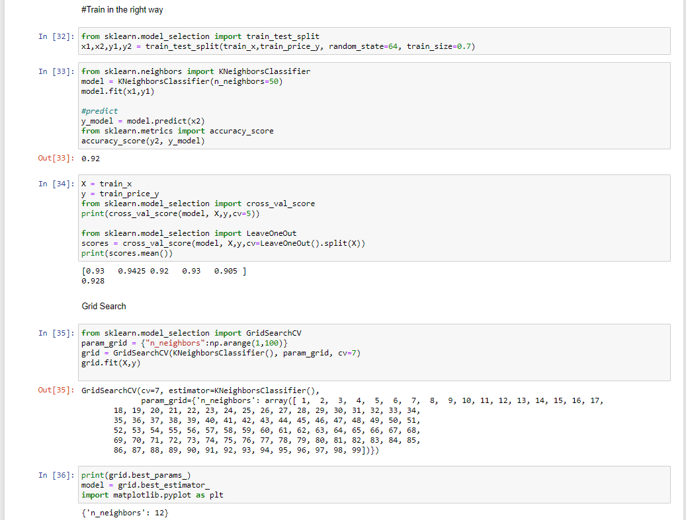
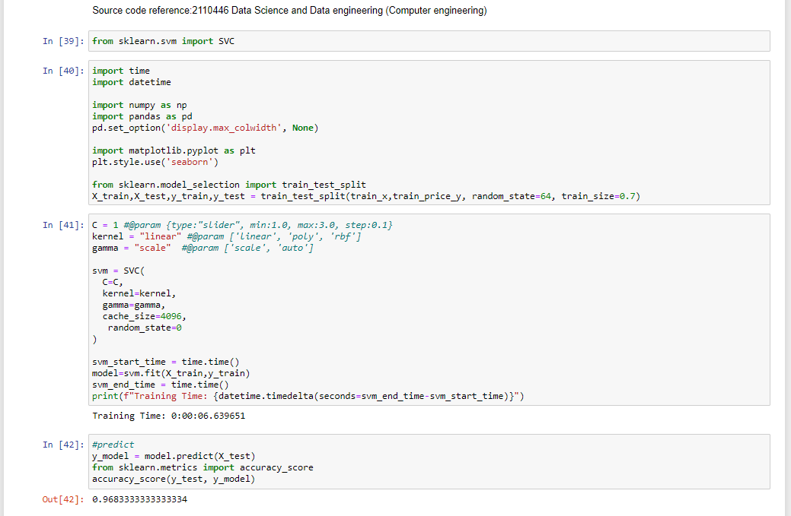
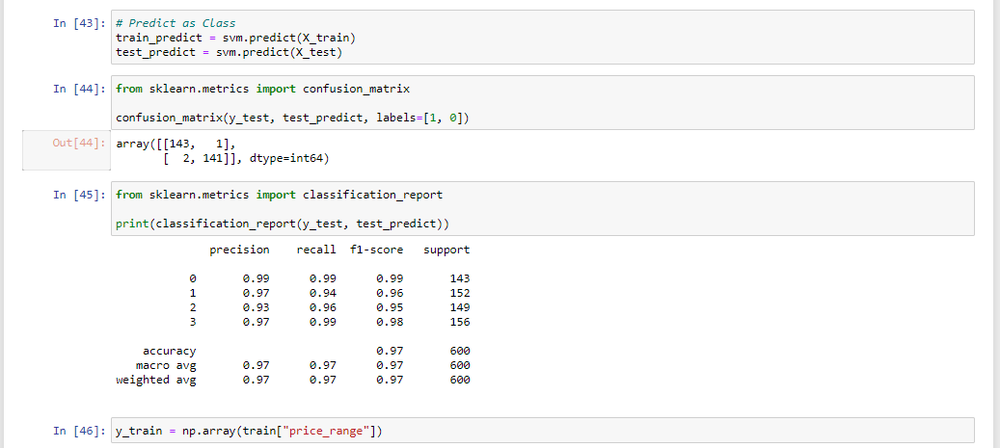

# Repo_hw_group test

### รายชื่อสมาชิก
| Name|ID|Email|
|-------------|:--------:|-------------------:|
|ศิวนาถ เจียรวงศ์ตระกูล |6370465121 |nonehjung@gmail.com|
|ภาธร กิติศุภวัฒนา |6130413221 |6130413221@student.chula.ac.th|
|ภีระพงศ์ คงบางปอ |6130421221 |peerapong.k2000@gmail.com|
|จารุพจน์ ถนอมรักษ์ |6370453621 |mapraw1997@hotmail.com|

## Mobile Price Classification

### Using model

* Neural network
* K-means clustering with Grid Search
* Support vector classification

## Create API 
We create API myself with Flask library Python because we cannot use kaggle API. 
Before downloading API, we must type activte in virtual environment in Script folder
and flask run in venv folder.

### Next, importing data from created API

### After that,
pre-processing data and create one hot encoder for classifying with Neural network.

### Training data in the wrong way (training all of data) with Neural network and K-means clustering techniques.

### Training data in the right way (splitting training and testing data) with Neural network and K-means clustering techniques.

### Using grid search to find the most suitable parameter of K-means clustering.

### Training data in another way, Support vector classification.

### Classification report of Support vector classification.

### Data visualization of the best model, support vector classification. 

### Data visualization of the best model with plotty, support vector classification. 

### Discussion
Support vector classification and K-means clustering are machine learning method. They are suitable for classifying
task. In reality, higher specification of smart phone usually has higher price so we can use any type of classification to find the seperating line between classified price. 
Therefore, the accuracy of them are more than 90%. 
However, Neural network shows a bad accuracy because we have not experience about the way
to improve an accuracy so it has only around 75 %.

### Reference
[Kaggle] (https://www.kaggle.com/iabhishekofficial/mobile-price-classification)

