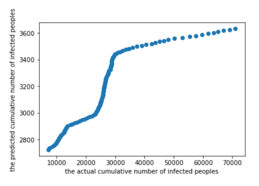
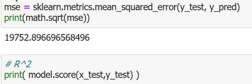
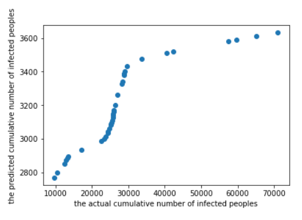

# Term Project: Cloud-Based Machine
Purpose: This project is trying to predict the amount of 2021 Covid-19 Infected person in Thailand by using Thai department of disease control 2020 and 2021 information with the linear regression ML model.

## Group member

|  Member ID      |              Name            |        E-mail                         
|----------------|-------------------------------|-----------------------------|
|6370406121       |Phanuwut Rojnarong            |phanuwut.project@gmail.com          |
|6030350221       |Patiphan Choomaneechot        |taeza17@gmail.com            |
|6370411221        |Rhatchada inrun              |Rhatchada@outlook.com|

## Result
The first result was trained by 12 months ( 1st January - 31 December) 2020 infected person information.

Comment:  We can see that the linear regression model using the data in 2020 is obviously not effective. Therefore we can state that the growing rate behavior of the cumulative number of people infected with Covid-19 is not the same as the previous year.

The second result was trained the 2021 infected person information. The information is start from 1st January to 17th April 2021.

Comment: We can see that both model with dataset using data in 2020 or 2021 give us a similar predictive curve and not effective. So, we can not predictive the cumulative Number of people infected with COVID19 in each day via the linear model. 

Suggestion: To get a better result, we may try using the neural network or the deep learning model later in the future.

## Resource
Covid-19 Infected database:  https://covid19.th-stat.com/en/api